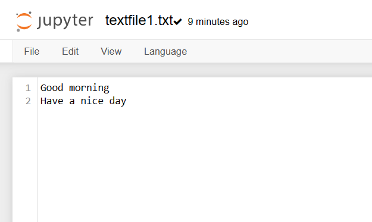
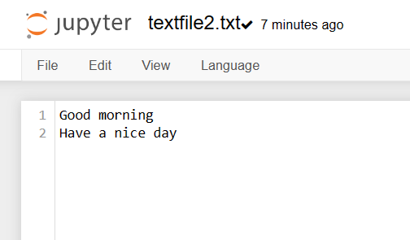

# Copy-File
## AIM:
To write a python program for copying the contents from one file to another file.
## EQUIPEMENT'S REQUIRED: 
PC
Anaconda - Python 3.7
## ALGORITHM: 
### Step 1:
Load the CSV into a DataFrame.
### Step 2: 
 Print the number of contents to be displayed using df.head().
### Step 3: 
The number of rows returned is defined in Pandas option settings.
### Step 4:  
Check your system's maximum column with the pd.options.display.max_column statement.
### Step 5: 
Increase the maximum number of rows to display the entire DataFrame
### Step 6: 
End the program.
## PROGRAM:
```
#Developed by:LAVANYA S
#Register number:212223230112
def copy(fname,newfile):
    with open(fname) as fp:
        with open(newfile,'w') as fp1:
            data=fp.read()
            fp1.write(data)
copy("textfile1.txt","textfile2.txt")
    
```
### OUTPUT:



## RESULT:
Thus the program is written to copy the contents from one file to another file.
